# Particle Swarm Optimization (PSO) Benchmark Playground

## 📌 What is Particle Swarm Optimization?

**Particle Swarm Optimization (PSO)** is a population-based optimization algorithm inspired by the collective behavior of birds flocking or fish schooling.

- Each particle represents a **candidate solution** in the search space.
- Particles move with a **velocity** that combines:
  - **Inertia** (previous velocity, exploration),
  - **Cognitive component** (the particle’s own best experience),
  - **Social component** (the swarm’s best-known position).
- Over time, the swarm converges toward promising areas in the landscape.

PSO is widely applied in engineering, machine learning, and scientific optimization because it is simple, flexible, and effective.

---

## ⚙️ Key Parameters

PSO behavior is controlled by three main parameters:

- **Inertia weight ($w$):**  
  Controls how much of the previous velocity is preserved.  
  - High $w$ → encourages **exploration** (particles fly further, search broadly).  
  - Low $w$ → encourages **exploitation** (particles slow down, refine solutions).  
  Often decreased over time (e.g., from $0.9 \to 0.4$).

- **Cognitive coefficient ($c_1$):**  
  Scales how strongly a particle is pulled toward its own **personal best position**.  
  - High $c_1$ → particles act more **individually**, focusing on their own discoveries.  

- **Social coefficient ($c_2$):**  
  Scales how strongly a particle is pulled toward the **global best position** of the swarm.  
  - High $c_2$ → particles act more **cooperatively**, following the swarm leader.  

A good balance between $w$, $c_1$, and $c_2$ is crucial:  
- Too much exploration → slow convergence.  
- Too much exploitation → risk of getting stuck in local minima.  
- Typical defaults: $w \approx 0.7–0.9$, $c_1 \approx 1.5–2.0$, $c_2 \approx 1.5–2.0$.

---

### 📐 Velocity Update Formula

The velocity update rule in PSO is:

$$
v_{i}(t+1) = 
w \cdot v_{i}(t) \;+\;
c_{1} \cdot r_{1} \cdot (p_{i}^{best} - x_{i}(t)) \;+\;
c_{2} \cdot r_{2} \cdot (g^{best} - x_{i}(t))
$$

Where:  
- $v_i(t)$: velocity of particle $i$ at iteration $t$  
- $x_i(t)$: current position of particle $i$  
- $p_i^{best}$: particle’s own best-known position  
- $g^{best}$: global best position in the swarm  
- $r_1, r_2 \sim U(0,1)$: random numbers for stochasticity  

---

### 🎨 Visual Intuition

[PSO Velocity Update](docs/pso_velocity_update.png)

In this diagram, each arrow represents a different influence on a particle’s velocity update:

- **Blue arrow – Inertia ($w \cdot v$):**  
  The particle’s tendency to keep moving in the same direction as before.  
  - High $w$ → particles fly further, maintaining momentum (**exploration**).  
  - Low $w$ → particles slow down, focusing more on refinement (**exploitation**).  

- **Green arrow – Cognitive pull ($c_{1} r_{1} (p^{best} - x)$):**  
  The pull toward the particle’s own best-known position.  
  - Encourages **individual learning**.  
  - Each particle “remembers” where it personally found the best solution so far.  

- **Orange arrow – Social pull ($c_{2} r_{2} (g^{best} - x)$):**  
  The pull toward the best-known position in the entire swarm.  
  - Encourages **social learning**.  
  - Particles follow the leader — whichever particle has found the best solution so far.  

- **Red arrow – New velocity:**  
  The final velocity is the **vector sum** of inertia, cognitive pull, and social pull.  
  This determines the actual direction and speed the particle will move in the next step.  

## 📊 About This Project

This project is a **PSO playground** for studying algorithm behavior across a wide range of **benchmark functions**.  

Features:

- **Configurable swarm parameters** (particles, iterations, inertia, cognitive/social weights).
- **Convergence tracking** with plots saved automatically to `docs/`.
- **2D animations** with contour landscapes and particle trails.
- **Hybrid Gradient Descent refinement** for fine-tuning final solutions.
- **Parallel fitness evaluation** for speed on high-dimensional problems.

---

## 📈 Benchmark Functions

Benchmark functions are **standard testbeds** in optimization research.  
They are not designed for one algorithm specifically — instead, they provide a **common ground** to compare different optimization techniques.

Why they matter:
- 🎯 **Known solutions** → Most benchmark functions have well-defined global minima (or multiple optima), making it easy to check if an algorithm works.  
- 🌄 **Diverse landscapes** → They include smooth convex bowls, narrow valleys, highly multimodal surfaces, and deceptive traps.  
- 🧪 **Stress tests** → Running PSO (or any algorithm) on them reveals strengths (fast convergence, robustness) and weaknesses (premature convergence, sensitivity to parameters).  
- 🔬 **Fair comparison** → Researchers can compare PSO directly against Genetic Algorithms, Differential Evolution, or other methods on the same set of functions.  

In this project, we use these functions as a **playground** to observe how PSO behaves in different scenarios:  
- Easy cases (Sphere, Booth, Matyas)  
- Hard multimodal cases (Ackley, Rastrigin, Eggholder)  
- Deceptive cases (Schwefel, Bukin N.6)  
- Multiple optima (Himmelblau, Six-Hump Camelback)  

They give us a **clear picture of PSO’s capabilities** before applying it to real-world problems.

### Ackley Function (Convergence Plot) ([details](https://www.sfu.ca/~ssurjano/ackley.html))

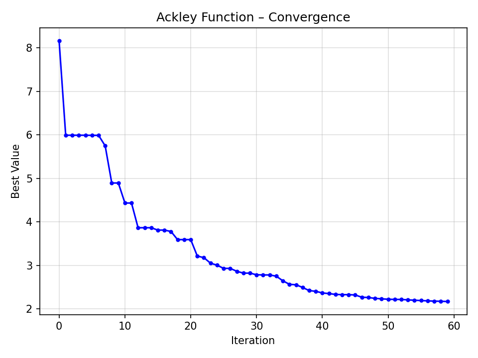

The **Ackley function** is a multimodal test function with many local minima.  
It challenges PSO to escape local traps and find the global minimum.

---

### Beale Function (2D Animation) ([details](https://www.sfu.ca/~ssurjano/beale.html))

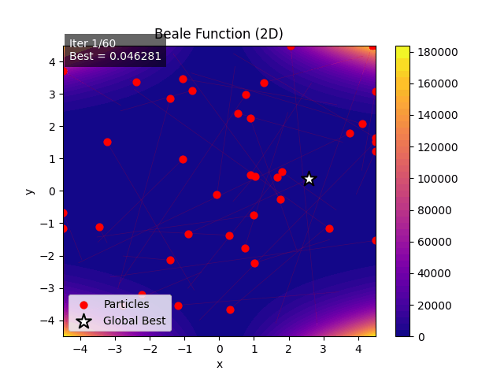

The **Beale function** is a classic 2D benchmark with steep valleys and multiple local minima.  
PSO must balance exploration and exploitation to converge.

---

### Booth Function (2D Animation) ([details](https://www.sfu.ca/~ssurjano/booth.html))

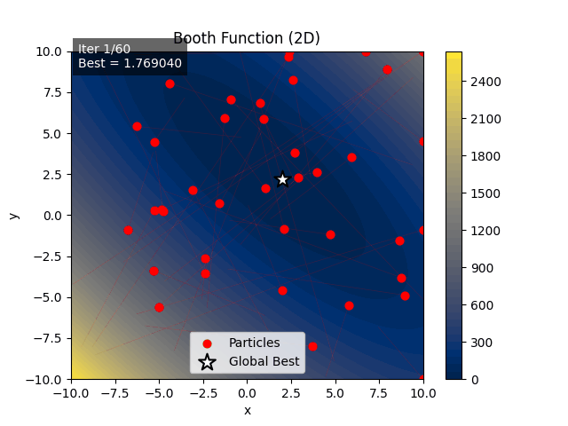

The **Booth function** is smooth and convex in 2D.  
It is relatively easy for PSO, converging quickly to the global optimum.

---

### Cross-in-Tray Function (2D Animation) ([details](https://www.sfu.ca/~ssurjano/crossit.html))

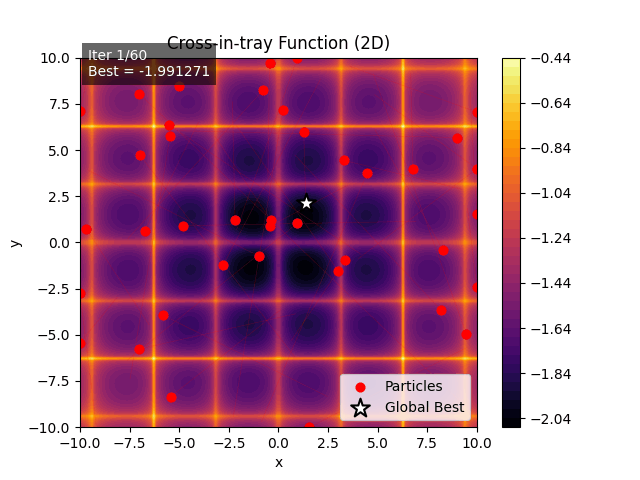

The **Cross-in-Tray function** has multiple global minima and sharp peaks.  
It is highly multimodal, testing PSO’s global search ability.

---

### Easom Function (2D Animation) ([details](https://www.sfu.ca/~ssurjano/easom.html))

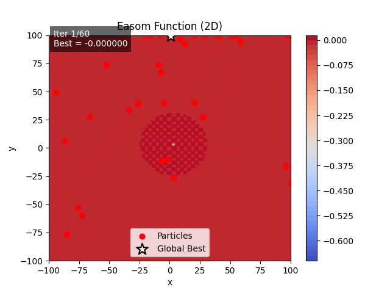

The **Easom function** has a single sharp global minimum surrounded by flat plateaus.  
It is extremely deceptive because most of the search space is flat.

---

### Eggholder Function (2D Animation) ([details](https://www.sfu.ca/~ssurjano/egg.html))

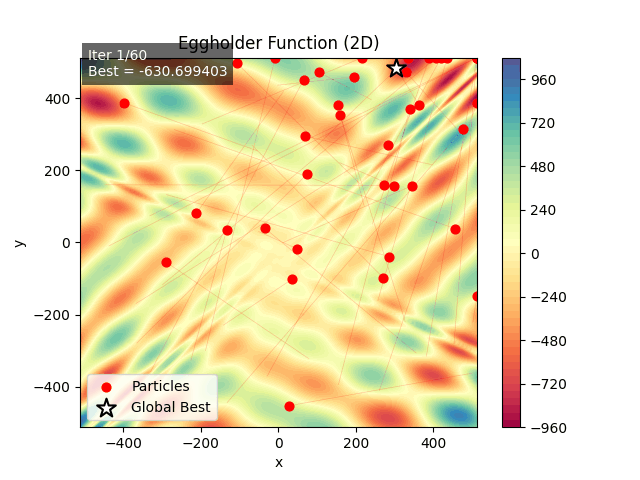

The **Eggholder function** is rugged and highly multimodal.  
Its steep ridges and valleys make it notoriously hard for PSO.

---

### Griewank Function (Convergence Plot) ([details](https://www.sfu.ca/~ssurjano/griewank.html))

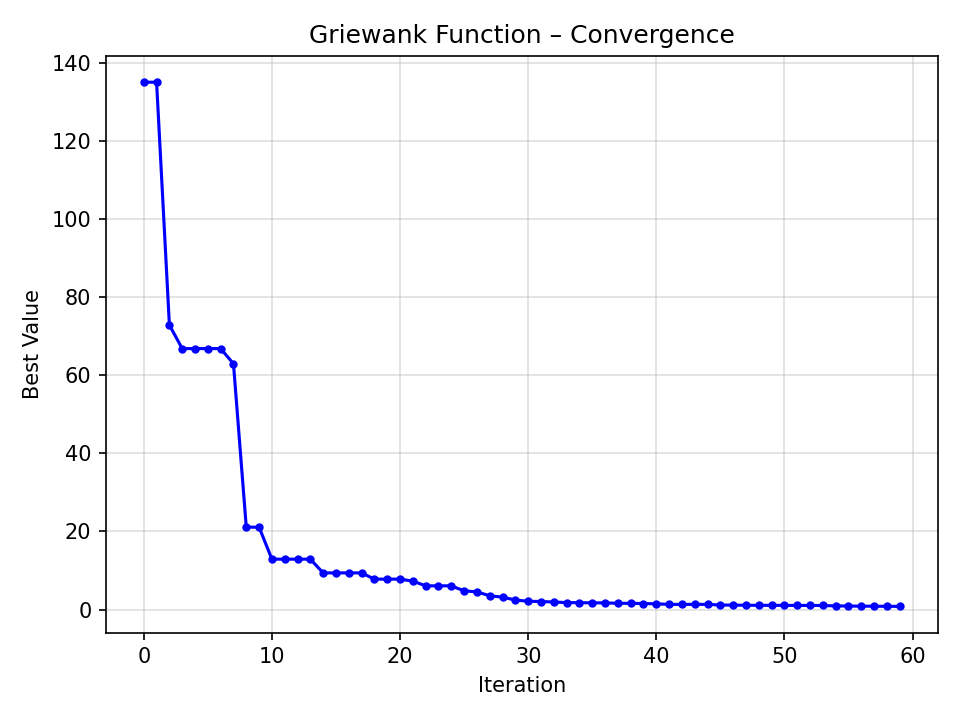

The **Griewank function** has many regularly distributed local minima.  
Its global structure, however, allows PSO to converge steadily.

---

### Himmelblau Function (2D Animation) ([details](https://www.sfu.ca/~ssurjano/himmel.html))

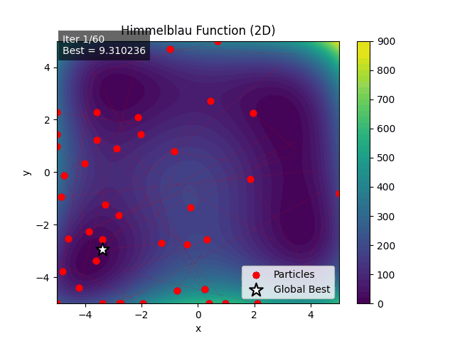

The **Himmelblau function** has **four global minima**.  
PSO can converge to different optima depending on initialization.

---

### Levy Function (Convergence Plot) ([details](https://www.sfu.ca/~ssurjano/levy.html))

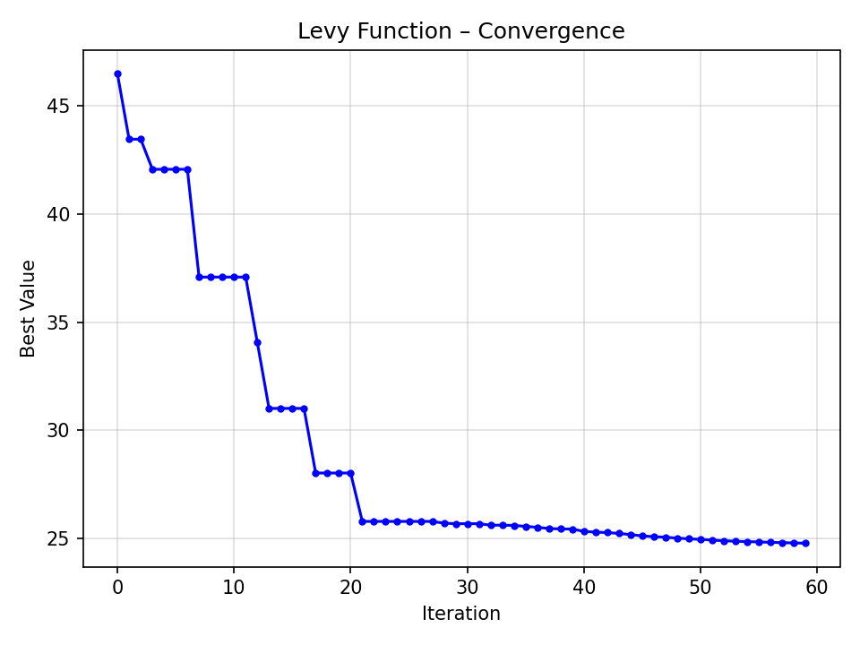

The **Levy function** is continuous, multimodal, and nonlinear.  
It forces PSO to explore widely before refining solutions.

---

### Matyas Function (2D Animation) ([details](https://www.sfu.ca/~ssurjano/matya.html))

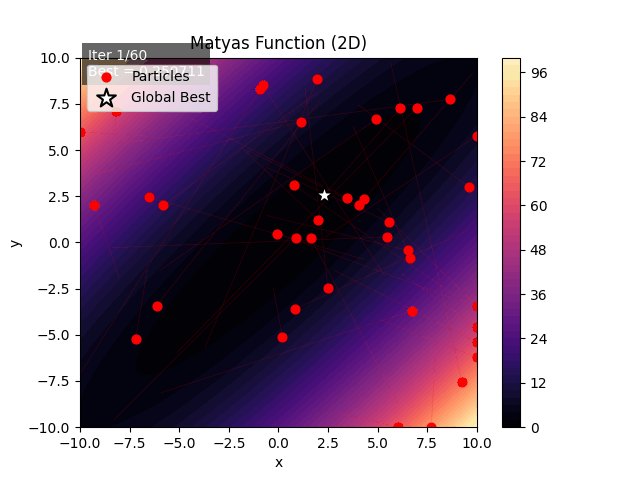

The **Matyas function** is convex and simple in 2D.  
PSO converges easily, making it a baseline benchmark.

---

### Rastrigin Function (Convergence Plot) ([details](https://www.sfu.ca/~ssurjano/rastr.html))

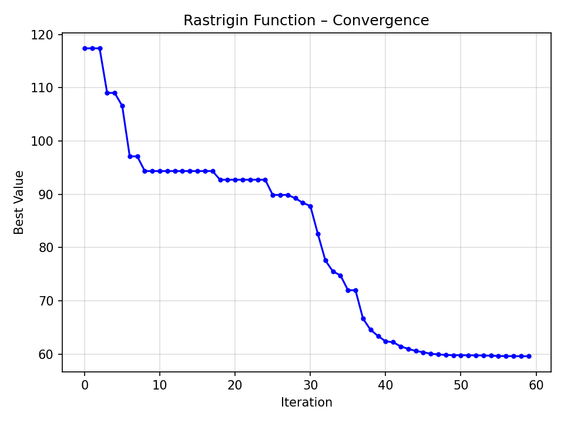

The **Rastrigin function** is highly multimodal with many local minima.  
It is widely used to test the exploration capability of algorithms.

---

### Rosenbrock Function (Convergence Plot) ([details](https://www.sfu.ca/~ssurjano/rosen.html))

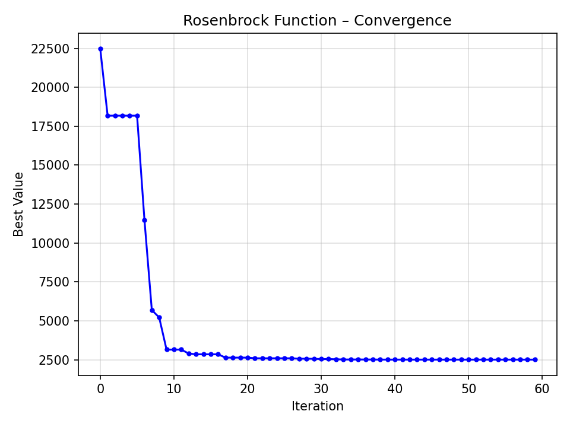

The **Rosenbrock function** has a narrow curved valley leading to the minimum.  
It is hard for PSO since convergence requires precise movement along the valley.

---

### Schwefel Function (Convergence Plot) ([details](https://www.sfu.ca/~ssurjano/schwef.html))

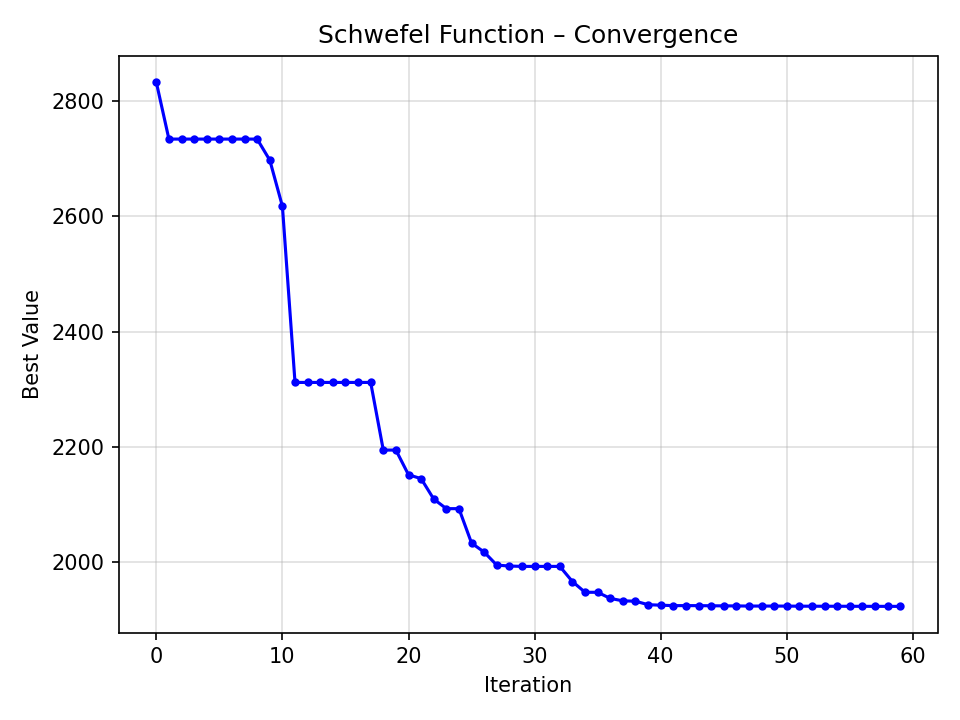

The **Schwefel function** is deceptive and multimodal.  
Its global minimum is far from the origin, often misleading PSO.

---

### Six-Hump Camelback Function (2D Animation) ([details](https://www.sfu.ca/~ssurjano/camel6.html))

The **Six-Hump Camelback function** has six minima, including two global minima.  
It is a standard 2D test for PSO and genetic algorithms.

---

### Sphere Function (Convergence Plot) ([details](https://www.sfu.ca/~ssurjano/spheref.html))

The **Sphere function** is the simplest convex benchmark.  
PSO converges very quickly, making it an easy baseline test.

---

### Three-Hump Camel Function (2D Animation) ([details](https://www.sfu.ca/~ssurjano/camel3.html))

The **Three-Hump Camel function** is polynomial in shape.  
It has a single global minimum and is relatively easy for PSO.

---

### Zakharov Function (Convergence Plot) ([details](https://www.sfu.ca/~ssurjano/zakharov.html))

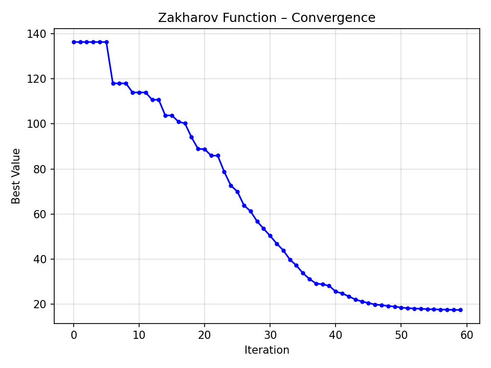

The **Zakharov function** combines linear and quadratic terms with a curved valley.  
It is unimodal but requires careful convergence along the valley floor.
